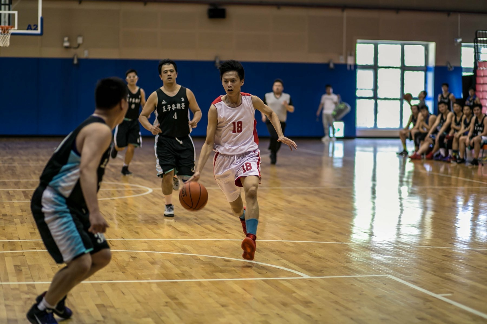
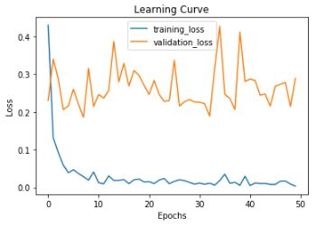
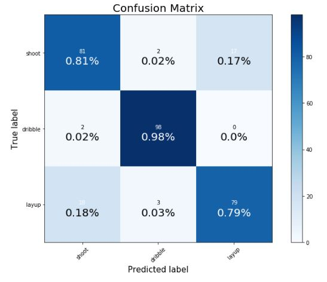
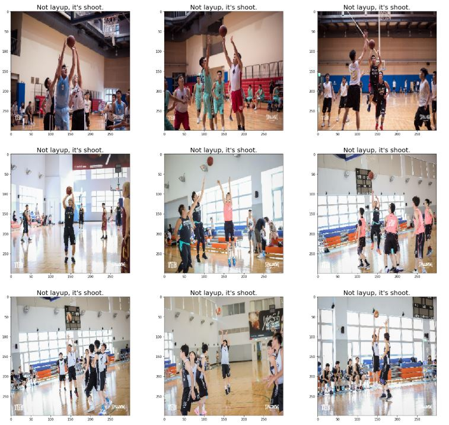
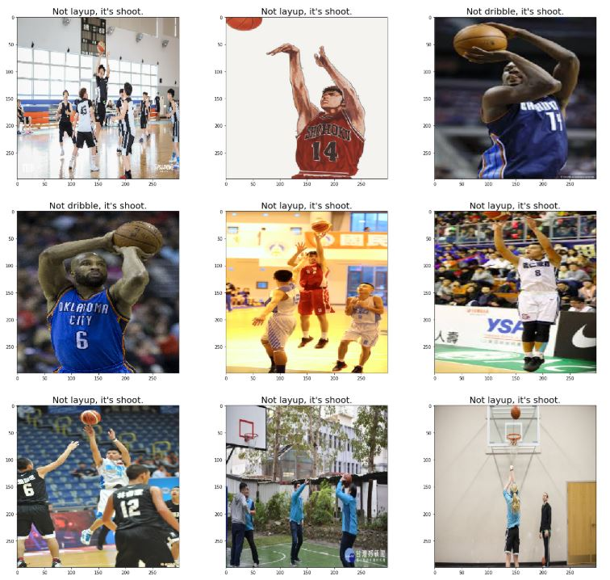
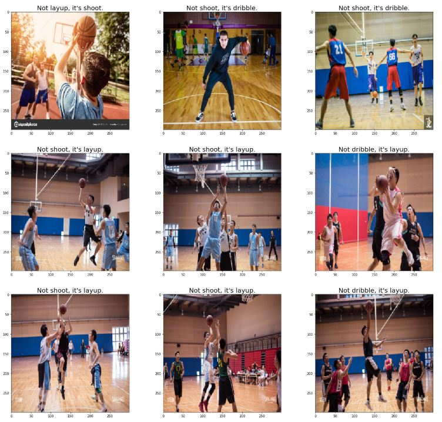
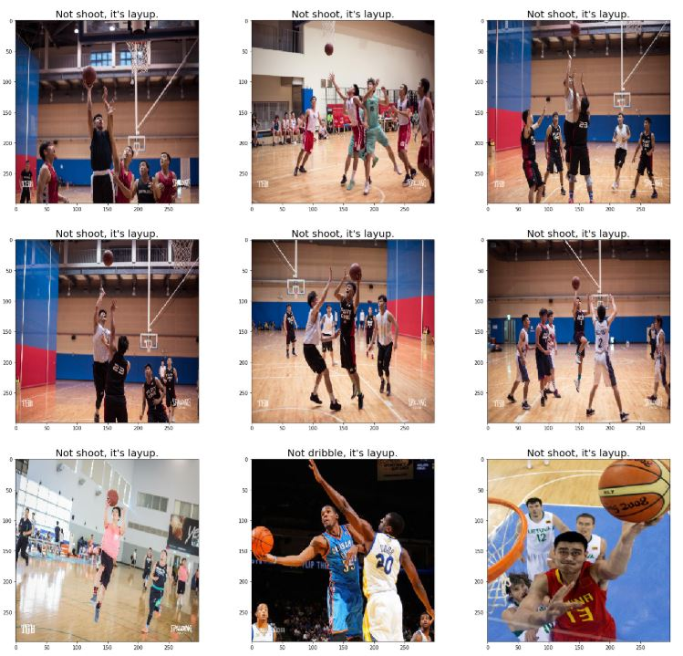
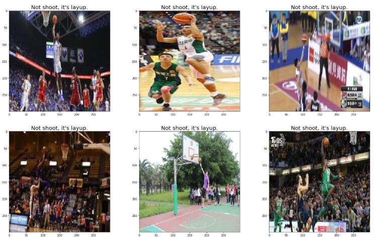

# basketball_classifier
## 使用keras(tensorflow backend)實踐transfer learning影像分類
### 專案介紹

為練習運用transfer learning 影像分類實現辨識籃球動作的專案，data source主要來自台灣各大周末聯賽公開的facebook粉絲團相簿。  

主要將動作分為三類：**運球(dribble)、上籃(layup)、投籃(shoot)**  
**運球(dribble)：**  
  
**上籃(layup)：**  
    
**投籃(shoot)：**  
  
training data dribble：967、layup：869、shoot：945  
testing datas dribble：100、layup：100、shoot：100  
下為專案架構：
```
├── checkpoints/
├── coreml_models/
├── dataset/
│   ├── test/
|   |   ├─ dribble/
|   |   ├─ layup/
|   |   └─ shoot/
│   └── train/
|       ├─ dribble/
|       ├─ layup/
|       └─ shoot/
├── models/
├── scripts/
│   ├── covert_model_to_coreml.ipynb
|   ├── data_collect.ipynb
│   └── model_training.ipynb
├── requirements.txt
└── README.md
```
- **checkpoints**：存放訓練時loss較前幾次小的model的資料夾。  
- **models**：存放從**checkpoints**資料夾中測試完準確率較高的模型。  
- **coreml_models**：存放從**models**資料夾中的*.h5 model所轉成的*.mlmodel檔案，拿來丟進xcode建立ios行動裝置app等。  
- **dataset**：存放taining data及testing data，以資料夾名稱作為分類label。  
- **scripts**：存放專案相關的code，**data_collect.ipynb**主要利用FB的Graph API及爬蟲抓取公開粉絲團的籃球比賽照片至local，**model_training.ipynb**作主要訓練與測試到儲存模型的工作，**covert_model_to_coreml.ipynb**利用coremltools.converters.keras.convert將keras的h5模型檔轉成apple的coreml_model格式。  
- **requirements.txt**：敘述本專案的環境與安裝之module版本

### 結果Result
本專案最終採用 **inceptionV3**模型並全部layers都設定更新訓練參數，從learning curve中可以看出來因為training data才2700多張所以超級 ***over fitting!!!*** ，未來會慢慢再增加data讓整個模型更加完善。  
  
performance in testing data:  
  
plot error-predicted images:  
 
  
 
  
  
可以看出模型在判斷投籃(shoot)與上籃(layup)間錯誤較多，事實上這兩個動作之間本身就存在一些模糊的空間，可能在一開始資料分類時就必須更清楚的定義何謂投籃(shoot)？何謂上籃(layup)？  
最後附上模型轉成coreml格式並build成IOS app的成果。
[basketball_move_classifier](https://www.youtube.com/watch?v=6otRvjD8epQ&index=4&t=0s&list=PL20F19SmKzYRvpP-BuQfOHKf7bP__Y2AS )
